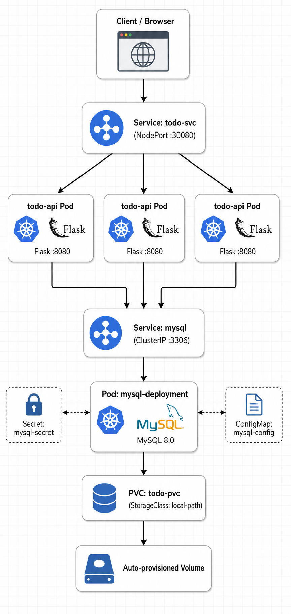

# Todo API — Flask + MySQL on Kubernetes

A simple Todo REST API (Flask) backed by MySQL, deployed on Kubernetes with dynamic persistent storage via **StorageClass** (`local-path`)

## Architecture



**3 replicas** of the API sit behind one Service for load balancing and zero-downtime rolling updates. All 3 share the **same MySQL instance**, so data is always consistent no matter which Pod handles a request.

## How the Pieces Connect

| Object | Role |
|---|---|
| `Namespace: hands-on` | Isolates all project resources |
| `Secret: mysql-secret` | Stores `MYSQL_ROOT_PASSWORD` and `DB_USER`/`DB_PASSWORD` — never hardcoded |
| `ConfigMap: mysql-config` | Stores non-sensitive config: `MYSQL_DATABASE`, `DB_HOST`, `DB_NAME` |
| `PVC: todo-pvc` | Requests 500Mi storage via the `local-path` StorageClass — **no manual PV needed**, storage is created automatically |
| `Deployment: mysql-deployment` | Runs 1 MySQL Pod, mounts `todo-pvc` at `/var/lib/mysql` so data survives Pod restarts |
| `Service: mysql` (ClusterIP) | Gives MySQL a stable internal DNS name (`mysql:3306`) for the API to connect to |
| `Deployment: todo-api-app` | Runs 3 Flask API replicas, connects to MySQL using `DB_HOST`, `DB_USER`, `DB_PASSWORD`, `DB_NAME` |
| `Service: todo-svc` (NodePort) | Exposes the API externally on port `30080` |

## Configuration — ConfigMap & Secret

```yaml
# ConfigMap — non-sensitive
apiVersion: v1
kind: ConfigMap
metadata:
  name: mysql-config
  namespace: hands-on
data:
  MYSQL_DATABASE: tododb
  DB_HOST: mysql
  DB_NAME: tododb
```

```bash
# Secret — sensitive, created via CLI (never committed to Git)
kubectl create secret generic mysql-secret \
  --from-literal=MYSQL_ROOT_PASSWORD=<your-password> \
  --from-literal=DB_USER=root \
  --from-literal=DB_PASSWORD=<your-password> \
  -n hands-on
```

The `todo-api-backend` container reads `DB_HOST` and `DB_NAME` from the ConfigMap, and `DB_USER`/`DB_PASSWORD` from the Secret — cleanly separating what's safe to expose from what must stay protected.

## Storage Note

This project uses **dynamic provisioning via StorageClass**, not a manually created PersistentVolume. The PVC simply requests storage:

```yaml
storageClassName: "local-path"
resources:
  requests:
    storage: 500Mi
```

The `local-path-provisioner` running in the cluster watches for this PVC and automatically creates the backing storage — the same pattern used in production with cloud StorageClasses (e.g. AWS EBS `ebs.csi.aws.com`), just backed by local disk instead of a cloud volume.

## API Endpoints

| Method | Path | Description |
|---|---|---|
| GET | `/health` | Health check (used by readiness/liveness probes) |
| GET | `/todos` | List all todos |
| POST | `/todos` | Create a new todo |
| GET | `/stats` | Persisted request counter |

## Deploy It

```bash
kubectl apply -f namespace.yaml
kubectl apply -f mysql-config.yaml
kubectl create secret generic mysql-secret \
  --from-literal=MYSQL_ROOT_PASSWORD=<your-password> \
  --from-literal=DB_USER=root \
  --from-literal=DB_PASSWORD=<your-password> -n hands-on
kubectl apply -f todo-pvc.yaml
kubectl apply -f mysql-deployment.yaml
kubectl apply -f mysql-service.yaml
kubectl apply -f todo-api-deployment.yaml
kubectl apply -f todo-svc.yaml
```

## Key Design Decisions

- **Rolling updates with zero downtime** — `maxSurge: 1, maxUnavailable: 0` ensures a new Pod is ready before an old one is removed
- **Readiness/liveness probes on `/health`** — Kubernetes won't route traffic to a Pod until MySQL connectivity is confirmed
- **Secrets vs ConfigMaps** — credentials isolated from non-sensitive config
- **StorageClass over manual PV** — matches real production workflow; storage is requested, not pre-built

## Lessons Learned Building This

- A Service `selector` that doesn't match Pod labels causes silent `CrashLoopBackOff` with "connection refused" — always verify `kubectl get endpoints <svc>`
- Apps that connect to a DB at startup are vulnerable to race conditions if the DB isn't ready yet — an init container health check is the production-grade fix
- `local-path` StorageClass is a great stand-in for cloud-backed StorageClasses when learning — the YAML pattern (PVC → StorageClass) is identical to AWS EBS in production
